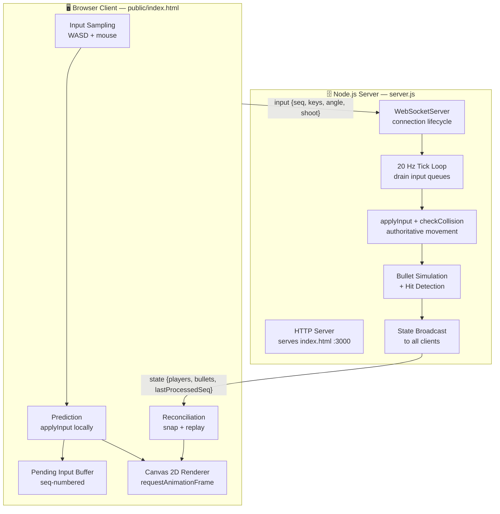
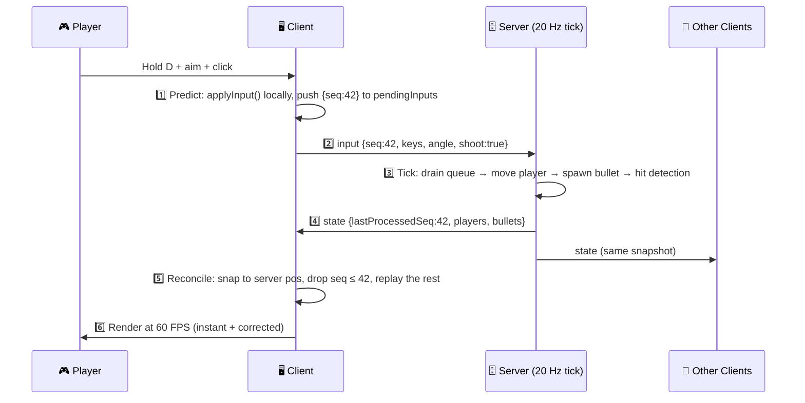

<div align="center">

# 🎮 Multiplayer Netcode

### A Real-Time Multiplayer 2D Arena Shooter — Netcode Built From Scratch

*A server-authoritative multiplayer shooter implementing the core networking techniques used in professional games — client-side prediction, server reconciliation, and server-side hit detection — over raw WebSockets, with zero game frameworks and a built-in lag simulator to prove it all works.*

<br/>


<br/>

[Features](#-features) •
[Architecture](#-architecture) •
[Networking Pipeline](#-the-networking-pipeline) •
[Techniques](#-networking-techniques-deep-dive) •
[Getting Started](#-installation) •
[Lag Simulator](#-the-lag-simulator)

</div>


---

## 📖 Overview

Most multiplayer tutorials hide the hard parts behind engines and networking libraries. This project does the opposite: **the entire netcode is hand-written** in two readable files — a Node.js server and a single-page browser client — using nothing but the `ws` WebSocket library and the Canvas 2D API.

The result is a real-time top-down arena shooter where:

- The **server owns the truth** — it runs the only real simulation at a fixed 20 Hz tick.
- Your movement feels **instant** despite latency, thanks to client-side prediction.
- Prediction errors are **silently corrected** through sequence-numbered server reconciliation.
- All shooting and damage is resolved by **server-side hit detection** — aim hacks are structurally impossible.
- A built-in **lag simulator** (`?lag=200`) lets you *see* the netcode working under bad network conditions.

If you want to understand how games like *Counter-Strike* or *Overwatch* keep players in sync over unreliable networks, this codebase is a minimal, honest demonstration of exactly those ideas — small enough to read in one sitting.

---

## ✨ Features

| | Feature | Description |
|---|---------|-------------|
| 🗄️ | **Server-Authoritative Simulation** | A fixed 20 Hz tick loop on the server is the single source of truth. Clients send *intent* (inputs), never *results* (positions). |
| ⚡ | **Client-Side Prediction** | Inputs are applied locally the instant they're sent — zero perceived input lag, even at 200+ ms simulated RTT. |
| 🔄 | **Server Reconciliation** | Every input carries a sequence number. When a snapshot arrives, the client snaps to the server's position and replays all unacknowledged inputs on top. |
| 🎯 | **Server-Side Hit Detection** | Bullets are simulated and collided on the server only. Clients merely *render* bullet positions broadcast in state snapshots. |
| 🧱 | **Wall Collision with Axis Separation** | Movement is resolved per-axis against arena walls, so players slide along surfaces instead of sticking — identical logic on client and server. |
| ❤️ | **Health, Death & Respawn** | 25 damage per hit, death at 0 HP, automatic respawn at a random position after 3 seconds — all managed server-side. |
| 🐌 | **Built-in Lag Simulator** | Append `?lag=200` to the URL to delay both send and receive by half the value — a first-class tool for demonstrating prediction and reconciliation. |
| 🔌 | **Raw WebSocket Protocol** | Five JSON message types (`welcome`, `playerJoined`, `playerLeft`, `input`, `state`) over a single persistent `ws` connection per player. |
| 📦 | **Zero Frameworks** | One dependency (`ws`). No game engine, no bundler, no client build step — the server serves a single HTML file. |

---

## 🏗 Architecture

The entire game is two components sharing one contract: **identical movement simulation code** on both sides (`applyInput` + `checkCollision` are duplicated verbatim), which is what makes prediction and reconciliation converge exactly.



### The Two Sides

| Component | File | Key Responsibilities |
|-----------|------|----------------------|
| **Server** | `server.js` | Serves the client over HTTP, accepts WebSocket connections, assigns each player an ID and color, queues incoming inputs per player, runs the authoritative 20 Hz tick (movement → bullets → hit detection → respawns), and broadcasts full state snapshots to every connected client. |
| **Client** | `public/index.html` | Samples WASD keys and mouse aim, sends sequence-numbered inputs at the tick rate, predicts its own movement immediately, reconciles against snapshots, and renders players, gun barrels, health bars, bullets, and walls on a Canvas at display refresh rate. |

### How They Communicate

One persistent **WebSocket** connection per player carries five JSON message types:

| Message | Direction | Purpose |
|---------|-----------|---------|
| `welcome` | Server → Client | Your assigned ID + the current roster of players |
| `playerJoined` | Server → Others | A new player's ID, spawn position, and color |
| `playerLeft` | Server → All | A player disconnected |
| `input` | Client → Server | `{seq, keys, angle, shoot}` — pure intent, nothing else |
| `state` | Server → All | Authoritative snapshot: every player's position, angle, health, death state, `lastProcessedSeq`, plus all live bullet positions |

> 💡 Note what the client **never** sends: its own position, whether it hit anything, or how much damage it dealt. The protocol itself makes those cheats impossible to express.

---

## 🔁 The Networking Pipeline

Every action you take travels through this pipeline:

```
Input → Client Prediction → Server Simulation → Reconciliation → Rendering
```



**Step by step, in plain language:**

1. **Input** — Every 50 ms (the tick interval), the client packages the current key state, mouse angle, and shoot flag into a numbered input (`seq` increments each time). The sequence number is the linchpin of the whole system — it's how both sides later agree on *which* inputs have been processed.

2. **Client Prediction** — Rather than waiting a full round-trip, the client runs the exact same `applyInput()` function the server uses and moves your square *immediately*. The input is stored in `pendingInputs` for later.

3. **Server Simulation** — On each tick, the server drains every player's input queue, applies movement with wall collision, spawns bullets for `shoot` inputs, advances all bullets, and resolves hits — deducting 25 HP, killing at 0, and scheduling a 3-second respawn.

4. **Reconciliation** — Each snapshot tells the client `lastProcessedSeq`. The client snaps your player to the server's authoritative position, discards every pending input the server has already seen, and **re-simulates the remainder** on top. If your prediction was right (it almost always is), the replay lands in exactly the same pixel — invisibly.

5. **Rendering** — A `requestAnimationFrame` loop draws the arena, walls, bullets, players with gun barrels and health bars, plus live debug info (pending input count and simulated lag) — decoupled from the 20 Hz network rate.

> 💡 **The key insight:** your own player lives slightly in the *predicted future*, while everything else you see is the server's *broadcast past*. Good netcode is the art of stitching those timelines together so the player never notices.

---

## 🧠 Networking Techniques Deep-Dive

<details open>
<summary><b>⚡ Client-Side Prediction</b></summary>
<br/>

**Problem:** With a naive client, pressing `D` does nothing until the server confirms it — a full round-trip later. At 200 ms RTT, your game feels like it's underwater. (Try commenting out the prediction block and running with `?lag=200` — it's painful.)

**Solution:** The client duplicates the server's exact movement code (`applyInput` + `checkCollision`) and applies each input the moment it's sent. Every applied input is stored in the `pendingInputs` array with its sequence number so it can be replayed during reconciliation.

**Trade-off:** The client is now *guessing*. If the guess is ever wrong, reconciliation cleans it up.

</details>

<details open>
<summary><b>🔄 Server Reconciliation</b></summary>
<br/>

**Problem:** Server snapshots describe the past — by the time one arrives, the client has already predicted several newer inputs. Naively snapping to the snapshot position would erase legitimate movement and cause rubber-banding.

**Solution:** Every snapshot carries `lastProcessedSeq` per player. On receipt, the client:

1. Sets your player to the server's authoritative `x, y`.
2. Filters `pendingInputs` to keep only `input.seq > lastProcessedSeq`.
3. **Re-applies** each remaining input with the same `applyInput()` used for prediction.

Because client and server share identical movement math, the replayed position matches the prediction exactly — the correction is invisible. The on-screen "Pending inputs" counter lets you watch this buffer grow with lag and drain as acks arrive.

</details>

<details open>
<summary><b>🗄️ Server Authority</b></summary>
<br/>

The server is the **single source of truth**. Clients send only *intent* — key states, an aim angle, a shoot flag. The server independently computes movement (with collision), bullet trajectories, damage, deaths, and respawns. Even a fully modified client cannot teleport, speed-hack, or fabricate hits, because the protocol has no message that could express those things. Dead players' inputs are ignored at both the socket handler *and* the tick loop.

</details>

<details open>
<summary><b>⏱️ Tick Updates</b></summary>
<br/>

The server runs a **fixed-timestep loop**: `setInterval(tick, 50)` — 20 ticks per second, `dt = 0.05 s`. Each tick drains input queues → simulates movement → advances bullets → resolves hits → broadcasts one snapshot. The client mirrors this cadence for *sending* inputs (so one input ≈ one tick of movement) but renders at full display refresh rate. Fixed timesteps keep the simulation deterministic regardless of network jitter or client frame rate.

</details>

<details>
<summary><b>🎯 Server-Side Hit Detection</b></summary>
<br/>

Bullets exist **only on the server**. When an input has `shoot: true`, the server spawns a bullet at the shooter's center traveling at 600 px/s along the shooter's angle, with a 2-second lifetime. Each tick, every bullet is tested against walls and against every other player's bounding box. On a hit: −25 HP, removal of the bullet, and — at 0 HP — death plus a 3-second respawn timer. The client just draws yellow dots at whatever positions the snapshot contains. There is nothing for an aimbot to exploit client-side.

</details>

<details>
<summary><b>🌐 Latency Compensation — the Lag Simulator</b></summary>
<br/>

Latency can't be eliminated, so it is *hidden* — and this project ships a tool to prove it. Appending `?lag=200` to the URL delays every outgoing message by 100 ms and every incoming message by 100 ms (half the RTT each way), simulating a 200 ms round-trip on localhost. With prediction + reconciliation active, your own movement remains pixel-perfect responsive; only the *consequences* (hits, other players) arrive later. This is the exact experience/authority trade every real multiplayer game makes.

</details>

<details>
<summary><b>🎞️ Entity Interpolation — 🚧 planned</b></summary>
<br/>

**Current behavior:** remote players are rendered at the raw position from the latest snapshot, so at 20 Hz they visibly step between positions rather than glide.

**The planned fix:** buffer the last few timestamped snapshots per remote player and render each one ~100 ms in the past, linearly interpolating between the two snapshots bracketing the render time. Remote players become perfectly smooth at the cost of a small, constant display delay. This is deliberately listed under [Future Improvements](#-future-improvements) — it's the natural next chapter of this codebase, and the snapshot pipeline already carries everything needed to implement it.

</details>

<details>
<summary><b>📦 JSON Message Protocol</b></summary>
<br/>

All messages are JSON objects discriminated by a `type` field, routed with simple conditionals on each side. The wire format is fully human-readable — open DevTools → Network → WS and you can watch every input and snapshot flow by, which makes debugging netcode dramatically easier than with a binary protocol. (Binary encoding is a listed future optimization once the protocol stabilizes.)

</details>

---

## 📂 Project Structure

```
multiplayer-netcode/
│
├── 🗄️ server.js              # The entire authoritative server:
│                             #   HTTP static hosting (port 3000)
│                             #   WebSocket connection lifecycle
│                             #   20 Hz tick: inputs → movement → bullets → hits
│                             #   Health / death / respawn logic
│                             #   State broadcasting
│
├── 🖥️ public/
│   └── index.html            # The entire client (single file):
│                             #   WebSocket connection + lag simulator
│                             #   Input sampling & sequence numbering
│                             #   Client-side prediction & reconciliation
│                             #   Canvas 2D rendering (players, bullets,
│                             #   walls, health bars, debug HUD)
│
├── package.json              # One dependency: ws
└── package-lock.json
```

> 💡 Two files of game code, on purpose. Every netcode concept lives somewhere you can point at.

---

## 🛠 Technology Stack

| Layer | Technology | Why |
|-------|-----------|-----|
| **Runtime** | Node.js (ES modules) | Event-driven I/O is a natural fit for a WebSocket game server |
| **Networking** | [`ws`](https://github.com/websockets/ws) 8.21 | Bare WebSocket transport — full visibility, no framework abstractions hiding the netcode |
| **Transport hosting** | `node:http` | The same server that hosts the game upgrades connections to WebSocket |
| **Serialization** | `JSON` | Human-readable wire format — watch the protocol live in DevTools |
| **Client** | Vanilla JavaScript | No build step, no bundler — open a browser tab and play |
| **Rendering** | HTML5 Canvas 2D | Immediate-mode drawing keeps the focus on networking, not engine plumbing |
| **Architecture** | Client–Server (authoritative) | Industry-standard trust model for competitive multiplayer |

---

## 📥 Installation

**Prerequisites:** [Node.js](https://nodejs.org/) 18+ (for stable ES modules support)

```bash
# Clone the repository
git clone https://github.com/Adhvaith-vemula/multiplayer-netcode.git
cd multiplayer-netcode

# Install the single dependency (ws)
npm install
```

---

## 🚀 Running the Project

```bash
# Start the authoritative server
npm start
# → Server running on http://localhost:3000
```

Then open **multiple browser tabs** at:

```
http://localhost:3000          # Player 1
http://localhost:3000          # Player 2 (new tab)
http://localhost:3000/?lag=200 # Player 3, with 200 ms simulated round-trip
```

> 🧪 **Try this:** open one normal tab and one with `?lag=200`, then move in the lagged tab. Your own square responds instantly (prediction), the "Pending inputs" counter climbs (unacknowledged inputs in flight), and everything still converges to the same positions in both tabs (reconciliation + server authority). That's the entire thesis of this project, visible on screen.

---

## 🎮 Gameplay Controls

| Input | Action |
|-------|--------|
| `W` `A` `S` `D` | Move your square |
| 🖱️ Mouse move | Aim (white barrel shows your direction) |
| 🖱️ Left click | Fire a bullet (25 damage, resolved server-side) |
| `?lag=N` in URL | Simulate N ms of round-trip latency |

**Rules of the arena:** 100 HP, 4 hits to kill, 3-second respawn at a random position. Walls block both movement and bullets — use the two pillars and center barrier for cover.

---


## 🔮 Future Improvements

- [ ] **Entity interpolation** — buffer snapshots and render remote players ~100 ms in the past for smooth motion between 20 Hz updates *(the top priority — see the deep-dive above)*
- [ ] **Lag compensation for hits** — rewind server state to the shooter's perceived time when validating shots (à la Valve's Source engine)
- [ ] **Delta-compressed snapshots** — send only what changed since the last acknowledged state instead of the full world every tick
- [ ] **Binary serialization** — swap JSON for a compact binary encoding once the protocol stabilizes
- [ ] **Score & kill feed** — track eliminations and display a scoreboard
- [ ] **Interest management** — only send nearby entities, enabling larger arenas
- [ ] **Rooms / matchmaking** — multiple concurrent arenas on one server process
- [ ] **Metrics HUD** — live RTT, tick duration, and reconciliation-error graphs

---

## 💡 Why This Project

Multiplayer networking is one of the few areas of game development where the hard problems can't be solved by "more code" — they require understanding **distributed systems under real-time constraints**. Building this without any framework forced concrete answers to questions engines normally hide:

- How do you keep controls responsive when every action takes a round-trip to confirm?
- How do you correct a wrong prediction without the player ever noticing?
- How do you design a protocol where cheating is *unexpressible* rather than merely detectable?
- How do you keep a fixed-rate simulation deterministic while inputs arrive at random times?
- How do you *prove* your netcode works? (Answer here: a URL-parameter lag simulator.)

Every one of those questions is answered in ~600 lines of readable code. The techniques — prediction, reconciliation, authoritative simulation, server-side hit detection — are the same ones documented in the classic netcode literature (Gabriel Gambetta's *Fast-Paced Multiplayer*, Valve's *Source Multiplayer Networking*, Glenn Fiedler's *Gaffer On Games*) and shipped in virtually every competitive multiplayer title.

---

## 🎓 Concepts Demonstrated

| Concept | Where It Lives |
|---------|----------------|
| **Real-time networking** | Persistent bidirectional WebSocket per player, 20 Hz state broadcast |
| **WebSockets** | Raw `ws` server attached to `node:http`; browser-native `WebSocket` client |
| **Multiplayer synchronization** | Fixed-tick authoritative simulation broadcast to all connected clients |
| **Prediction** | Client applies its own inputs immediately; `pendingInputs` buffer keyed by `seq` |
| **Reconciliation** | Snap to authoritative position → discard acked inputs → replay the rest |
| **Authoritative server** | Clients send `{keys, angle, shoot}` intent only; server computes all outcomes |
| **Hit detection** | Server-simulated bullets vs. wall AABBs and player bounding boxes |
| **Serialization** | Type-discriminated JSON protocol, inspectable live in DevTools |
| **Game loops** | 20 Hz fixed-timestep server tick, decoupled from `requestAnimationFrame` client rendering |
| **Interpolation** | 🚧 Planned — snapshot pipeline already carries the data needed (see Future Improvements) |

---


<div align="center">

**Built to understand netcode — not to hide from it.**

⭐ If this project helped you understand multiplayer networking, consider giving it a star!

</div>
